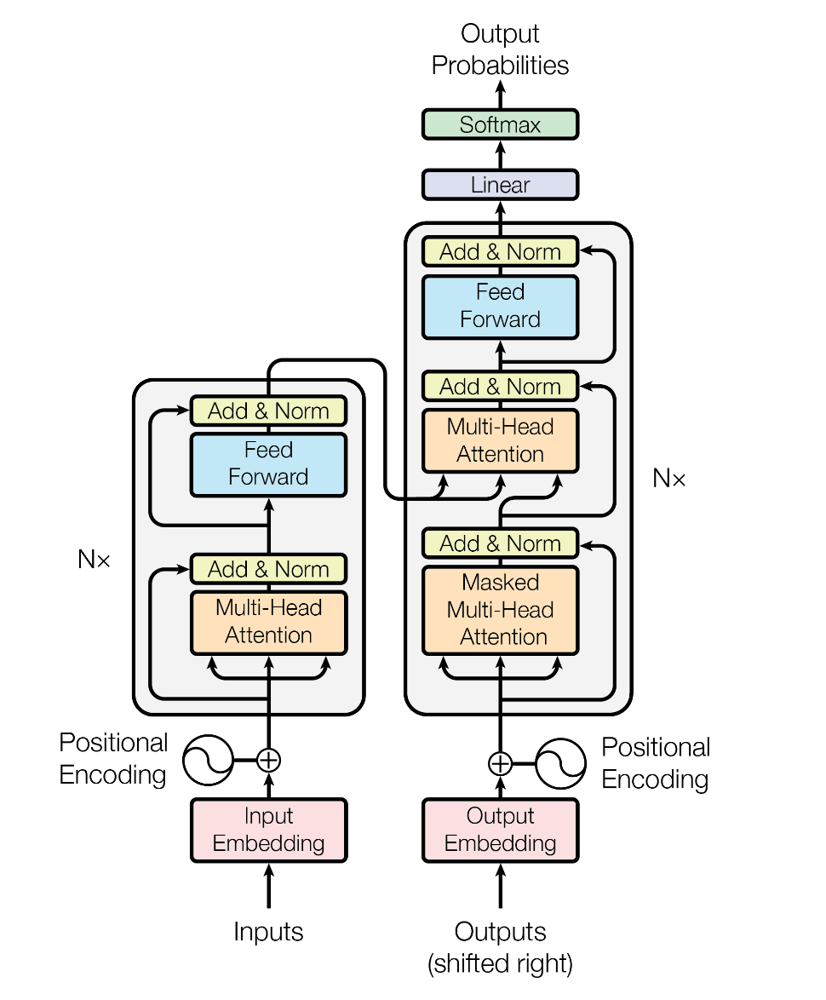

# **动手学Transformer**

简体中文 | [English](./README_en.md)

## **🚀 项目简介**

本项目从零开始复现论文《**Attention is All You Need**》提出的Transformer架构，通过逐模块代码实现与理论解析，深入剖析这一革命性模型的设计思想与实现细节。

## **📚 背景**

2017年提出的Transformer模型彻底改变了序列建模范式：

- ⚡ 完全基于注意力机制，摒弃RNN/CNN的时序依赖
- 🚄 并行计算友好，训练效率显著提升
- 🏗️ 成为BERT、GPT等里程碑模型的基石

## 架构图



## **✨ 学习路线**

| **阶段** | **主题**             | **完成状态** |
| -------- | -------------------- | ------------ |
| Day 1    | 📥 输入表示与位置编码 | ✅            |
| Day 2    | 👁️ 自注意力机制       | 🔜            |
| Day 3    | 🔍 编码器模块         | 🔜            |
| Day 4    | 🔮 解码器模块         | 🔜            |
| Day 5    | 🏆 完整Transformer    | 🔜            |

## **🔍 Day 1: 输入表示与位置编码**

- 输入嵌入层 

  - ✨ Token到向量的可学习映射
  - 🔢 缩放因子 `sqrt(d_model)`

- 位置编码 

  - 📐 正弦/余弦位置编码公式实现

  ```
  PE(pos,2i) = sin(pos/10000^(2i/d_model))
  PE(pos,2i+1) = cos(pos/10000^(2i/d_model))
  ```

  - 🧮 位置信息的数学表示
  - 🔄 相对位置编码的优势

[Tutorial](./tutorials/Day_1/输入表示与位置编码.md)

## **👁️ Day 2: 自注意力机制（🔜 即将更新）**

- 多头注意力机制
  - 🔄 并行注意力头的实现
  - 🔗 注意力矩阵的计算流程
- 缩放点积注意力
  - 📏 缩放因子的必要性
  - 🧮 Softmax的数值稳定性

## **🔧 Day 3: 编码器模块（🔜 即将更新）**

- 前馈神经网络
  - 🧠 位置级前馈的实现
  - 📈 激活函数的选择
- 残差连接与层归一化
  - 🔄 残差机制的重要性
  - 📊 归一化策略的理论基础

## **🔮 Day 4: 解码器模块（🔜 即将更新）**

- 掩码自注意力
  - 🔒 未来信息屏蔽实现
  - 👁️ 解码器注意力的特殊性
- 编码器-解码器注意力
  - 🔄 交叉注意力机制
  - 🔍 Query-Key-Value的信息流

## **🏆 Day 5: 完整Transformer（🔜 即将更新）**

- 模型整合
  - 🧩 完整架构组装
  - 🔄 前向传播流程
- 训练与优化
  - 📉 损失函数设计
  - 🔧 参数初始化策略

## **📚 参考资料**

- 📑 [**Attention is All You Need**](https://arxiv.org/pdf/1706.03762)

## **🤝 贡献指南**

欢迎对本项目做出贡献！

- 🐛 发现问题或有建议？提交issue
- 💡 改进代码或文档？提交PR
- 📚 分享学习心得或实现思路？参与讨论

## **📄 许可证**

MIT License

**如果本项目对您有帮助，请给个 ⭐️ 鼓励作者继续创作！**