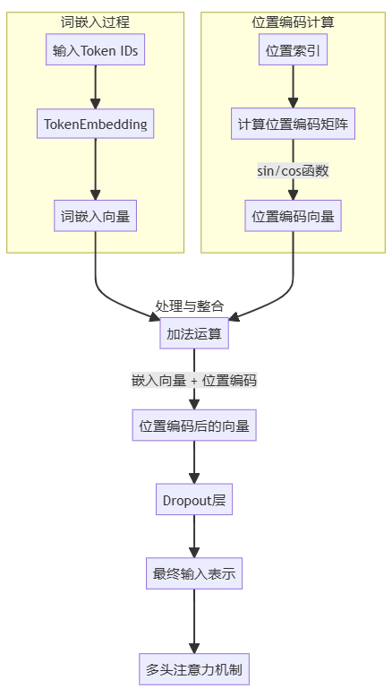

# Transformer的输入表示与位置编码

## 输入表示的整体流程

Transformer模型将原始文本转换为密集向量表示的过程包含两个核心部分：**词嵌入**（Token Embedding）和**位置编码**（Positional Encoding）。



## Transformer中的特殊标记

```markdown
[PAD]  # 填充标记：将不同长度的序列填充到相同长度（批处理必需）
[CLS] # 分类标记：通常放在序列开始位置，在分类任务中用于预测
[SEP] # 分割标记：标记句子结束或区分不同文本片段
[UNK]  # 未知标记：表示词汇表中不存在的词
[MASK]  # 掩码标记：在预训练中用于掩码语言建模任务
```

## 词嵌入：将tokens转换为向量

### 嵌入向量的实现原理

1. **嵌入矩阵结构**：
   - 维度为`[词汇表大小 × 嵌入维度]`
   - 例如，词汇表大小为30,000，嵌入维度为512时，矩阵形状为`[30000, 512]`
2. **词嵌入查找过程**：
   - 输入序列经过tokenizer处理后变成token ID序列（其中涉及两个阶段：第一步将输入序列进行分词得到词元（token），第二步在词汇表中查询token对应的ID）
   - 通过查表操作获取每个token ID对应的嵌入向量：`embedding_vector = embedding_matrix[token_id]`
3. **实现细节**：
   - 在PyTorch中使用`nn.Embedding`实现嵌入层
   - 在实际实现中，嵌入矩阵是模型的可学习参数之一

### 嵌入矩阵的来源

嵌入矩阵在模型训练过程中学习获得：

1. **初始化方式**：通常使用均值为0，标准差为`1/√d_model`的正态分布初始化
2. **学习过程**：训练中通过反向传播更新，词嵌入作为模型参数参与梯度下降
3. **语义捕获**：训练后，语义相似的词在向量空间中距离较近

## 位置编码：注入序列顺序信息

### 位置编码的必要性

Transformer的自注意力机制同时处理所有tokens，本身不具备序列顺序感知能力。在自然语言中，词序对意义至关重要，位置编码正是为了解决这一问题。

### 正弦余弦位置编码公式

$$
PE_{(pos,2i)} = \sin\left(\frac{pos}{10000^{2i/d_{\text{model}}}}\right)
$$

$$
PE_{(pos,2i+1)} = \cos\left(\frac{pos}{10000^{2i/d_{\text{model}}}}\right)
$$

其中：

- `pos`：token在序列中的位置（从0开始）
- `i`：维度索引（从0到d_model/2-1）
- `d_model`：模型维度（通常为512）

### 位置编码的关键设计

1. **交替使用sin和cos函数**：
   - 这种设计使任意位置的编码在高维空间中具有唯一性
   - 对于任意位置`pos`，使用`(sin(pos), cos(pos))`的组合可以唯一确定位置信息
   - 能够表示相对位置：对于任意偏移`k`，存在线性变换可将`PE(pos)`转换为`PE(pos+k)`
2. **频率梯度的设计理念**：
   - 低维度（小i值）使用低频率波形，变化缓慢，适合捕捉长距离关系
   - 高维度（大i值）使用高频率波形，变化迅速，能够区分近距离位置差异
   - 这种分布使模型能够在不同尺度上理解位置关系
3. **实现细节补充**：
   - 位置编码矩阵形状为`[max_seq_length, d_model]`
   - 对于每个位置，计算d_model维的位置向量
   - Transformer原始实现中最大序列长度为512

### 最终输入表示

词嵌入与位置编码相加后，通常会经过一个dropout层（默认率为0.1）以防止过拟合，得到最终输入表示：
$$
\text{最终输入} = \text{Dropout}(\text{词嵌入} + \text{位置编码})
$$
注意：原始论文中确实对词嵌入进行了缩放（乘以`√d_model`），但这并非标准实现的必要部分。这个缩放主要是为了控制嵌入向量的方差，使其与位置编码的幅度相匹配。有些实现在词嵌入后应用缩放，有些则在位置编码前应用缩放，还有一些实现完全忽略了这一步骤。

[代码实现](../../.././src/zh/Day_1/day_1.py)

## 位置编码的替代方案

原始Transformer使用固定的正弦余弦位置编码，但在后续研究中出现了多种替代方案：

1. **可学习的位置编码**：
   - 不使用固定公式，而是将位置编码设为可学习参数
   - BERT等模型采用这种方法，效果与固定编码相当
2. **相对位置编码**：
   - Transformer-XL提出的方法，只编码tokens之间的相对距离
   - 在处理长序列时表现更好，能更好地泛化到训练中未见过的序列长度

## 分词算法对比：Transformer与Jieba

当处理中文等非空格分隔语言时，分词算法的选择会显著影响模型性能：

1. **Transformer分词器**：
   - 基于subword单元（如BPE、WordPiece、SentencePiece）
   - 可以处理未登录词（OOV问题）
   - 在字符和词之间找到平衡，减少了词汇表大小
2. **Jieba分词器**：
   - 基于词典和统计模型的中文分词器
   - 能够识别中文语境中的完整词语
   - 不能很好处理新词和罕见词

Transformer模型的分词方式与传统NLP工具的差异是理解模型行为的重要因素。

下面我们将基于代码来比较两者在分词上的区别

[Jiaba vs tokenizer](../../.././src/zh/Day_1/cmp.py)

